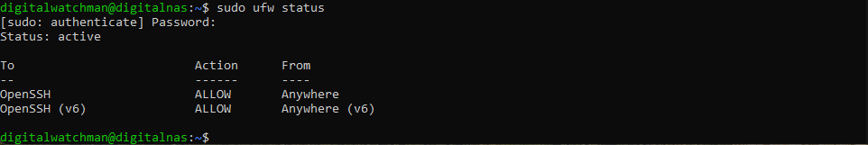
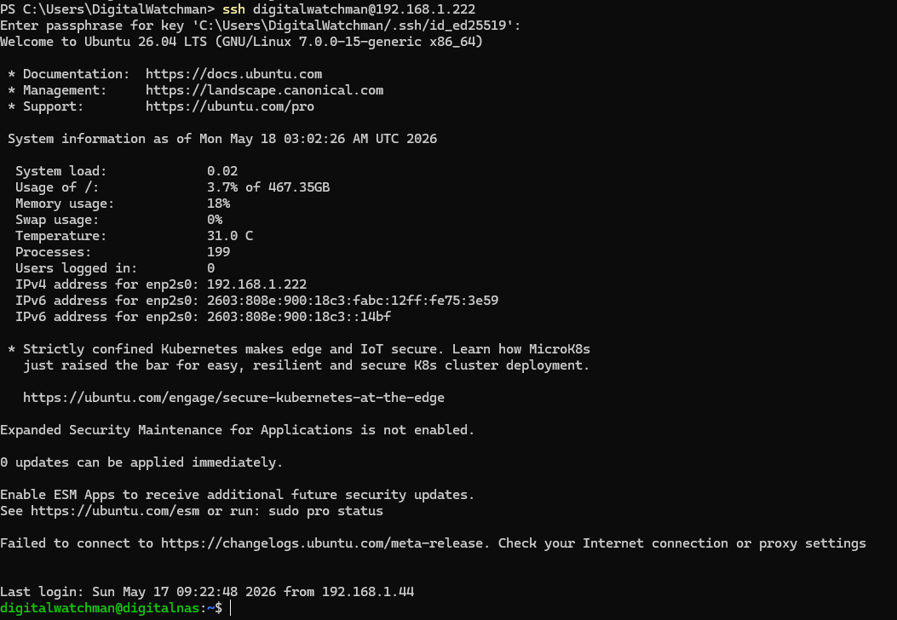
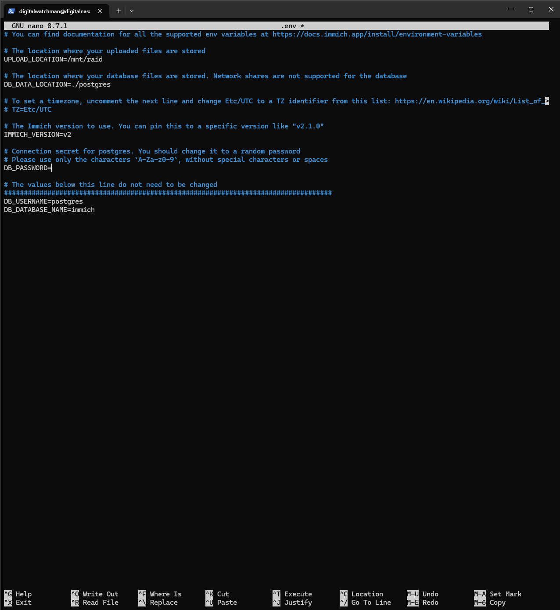
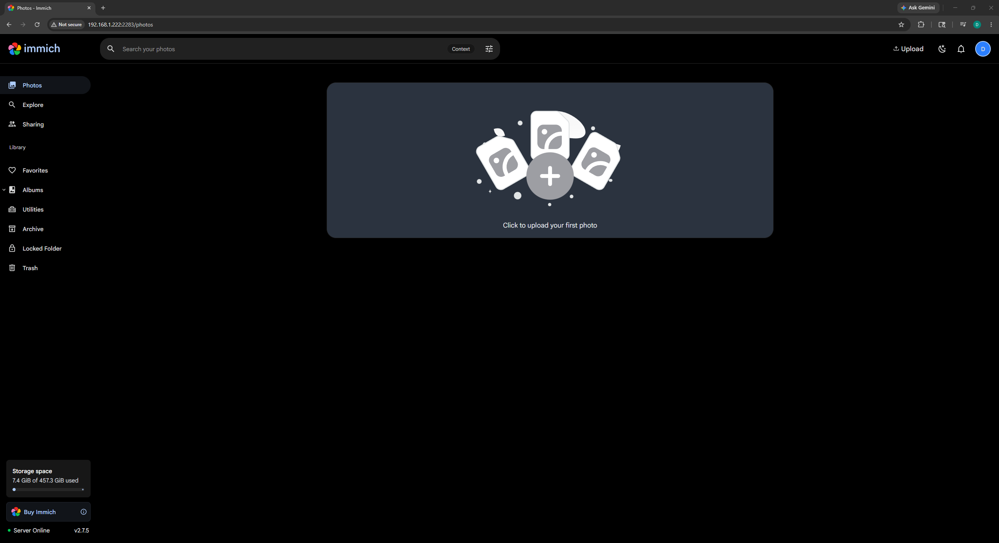
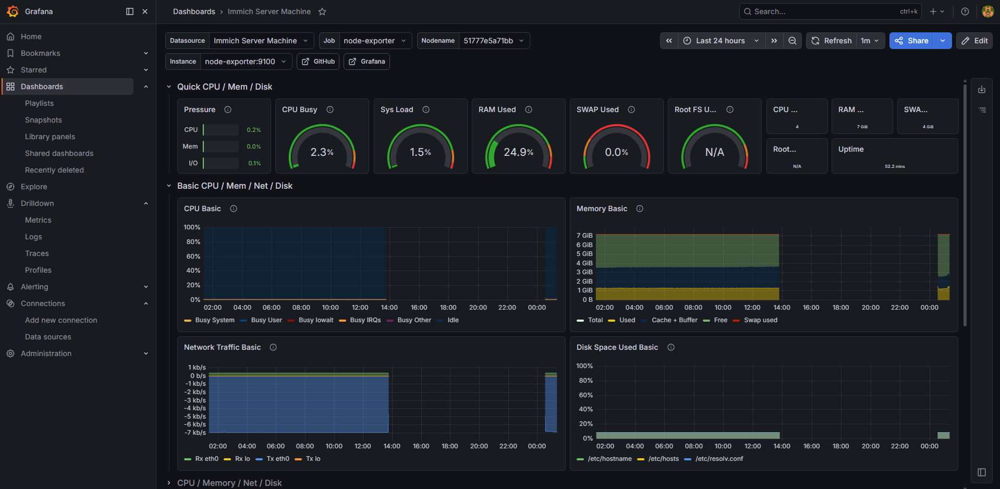

# Building a Self-Hosted Immich Server

## Background

My fiancée is an incredibly skilled artist. Over the last 6 months, she has built an art page across multiple platforms. Countless hours have been put into sketching, painting, recording, and editing content. Over time, her phone and Google Photos storage were filled to the brim and we began exploring options for larger storage. In our pursuit of the most cost-efficient option, I had an epiphany; why not create our own storage solution? This project is that solution.

---

## Hardware

For this project, I have decided to repurpose a used Dell OptiPlex 3020 that has been sitting in storage for the last few years. This will be our dedicated server machine.

**Dell OptiPlex 3020 Specs:**
- 2×4GB DDR3 RAM @ 1600MHz
- Intel i5-4570 @ 3.20GHz
- 290W Power Supply
- 1×500GB SSD
- 1×500GB HDD
- 1×1TB HDD

---

## OS & RAID Configuration

Ubuntu Server 26.04 LTS is my choice of OS because of its minimal resource requirements, long-term support, and versatility.

### Creating a Bootable USB Drive

To install Ubuntu Server onto our server machine, we will need to create a bootable USB drive with the OS `.iso` file.

1. Download [Ubuntu Server 26.04 LTS](https://ubuntu.com/download/server)
2. Download and install [balenaEtcher](https://etcher.balena.io/)
3. Using balenaEtcher, flash the Ubuntu Server `.iso` file onto a USB drive

### Configuring Ubuntu Server

Here are my Ubuntu Server configuration settings. I have opted to use manual IPv4 settings for a static IP address as well as select OpenSSH and Prometheus for installation.

| Setting | Value |
|---|---|
| Language | English |
| Keyboard Layout | English (US) |
| Installation Base | Ubuntu Server |
| Proxy | *(blank)* |
| SSH | OpenSSH Server |
| Featured Snaps | Prometheus |

**IPv4 Settings (Manual):**

| Field | Value |
|---|---|
| Subnet | 192.168.1.0/24 |
| Address | 192.168.1.222 |
| Gateway | 192.168.1.1 |
| Name Servers | 192.168.1.1 |

### Configuring Storage and Software RAID 1

All of my drives have been wiped and formatted prior to installation. During the OS configuration, I have opted to use a custom storage layout in order to configure a software RAID 1 (mirrored) array. I am using a 500GB SSD as my boot drive and two HDDs (500GB & 1TB) for my RAID 1 configuration. For now, this will only allow for 500GB in RAID 1 storage, but that is sufficient for now.

**Boot Drive:**

| Setting | Value |
|---|---|
| Partition Style | GPT |
| Size | 487.4GB (max available) |
| Format | ext4 |
| Mount | `/` |

**Software RAID Configuration:**

| Setting | Value |
|---|---|
| Name | md0 |
| RAID Type | 1 (mirrored) |
| Devices | 500GB HDD, 1TB HDD |
| Size | 457.3GB (max available) |
| Format | ext4 |
| Mount | `/mnt/raid` |

---

## Firewall Configuration

Now that the OS is installed and we are logged into the account I created during installation, the first thing I'll do is enable the firewall and create a rule to allow our SSH connection through it.

```bash
# Allow SSH traffic through the firewall
sudo ufw allow OpenSSH

# Enable firewall on startup and verify configuration
sudo ufw enable
sudo ufw status
```



---

## Headless Configuration

This server is designed to run headless. To accomplish this, I will configure it to be managed entirely through an SSH connection. OpenSSH Server was installed during the OS configuration, so I won't need to install it here.

### On the Server Machine

```bash
# Enable SSH on startup and ensure the service is running
systemctl enable ssh
systemctl start ssh
```

### On my Personal Computer

```bash
# Verify SSH connectivity
ssh digitalwatchman@192.168.1.222
```



> All further commands run on the server machine are via an SSH connection.

### SSH Key-Based Authentication

With connectivity verified, I will set up SSH key-based authentication as an additional security measure.

```powershell
# Generate an ED25519 key pair in Windows PowerShell. A passphrase is also set in this step.
ssh-keygen -t ed25519 -C "Immich-Server"
```

```powershell
# Copy the public key to the server machine and set permissions for the authorized_keys file and ~/.ssh directory
type $env:USERPROFILE\.ssh\id_ed25519.pub | ssh digitalwatchman@192.168.1.222 "mkdir -p ~/.ssh && cat >> ~/.ssh/authorized_keys && chmod 600 ~/.ssh/authorized_keys && chmod 700 ~/.ssh"
```

```bash
# Disconnect and reconnect to verify the SSH key pair is in use
ssh digitalwatchman@192.168.1.222
```

Since I have configured my SSH key pair with a passphrase, I will be disabling password authentication on the server machine. I will also disable root login and enable public key authentication. These changes are made in `/etc/ssh/sshd_config`:

```bash
sudo nano /etc/ssh/sshd_config
```

```
PermitRootLogin no
PasswordAuthentication no
PubkeyAuthentication yes
```


---

## Docker and Immich Installation

Now that our server machine is running headless, it is time to begin setting up Immich. I have decided to use Immich because it is highly user-friendly and feels very similar to Google Photos, which my fiancée is already accustomed to. To install Immich, I will first need to install Docker.

### Install Docker

```bash
# Download and run the Docker installation script, then verify Docker is installed
sudo curl -fsSL https://get.docker.com -o get-docker.sh
sudo sh get-docker.sh
docker version

# Enable Docker on startup
sudo systemctl enable docker

# Add user to the docker group created by the installation script, then reboot for changes to take effect
sudo usermod -aG docker digitalwatchman
reboot
```

### Install Immich

```bash
# Create a directory for the Immich app
mkdir -p ~/immich-app && cd ~/immich-app

# Download the Immich Docker Compose and environment files
wget -O docker-compose.yml https://github.com/immich-app/immich/releases/latest/download/docker-compose.yml
wget -O .env https://github.com/immich-app/immich/releases/latest/download/example.env
```

Configure the environment file:

```bash
sudo nano .env
```

```env
UPLOAD_LOCATION=/mnt/raid
DB_DATA_LOCATION=./postgres
DB_PASSWORD=<your_password>
```



```bash
# Start the Immich containers
docker compose up -d
```

To verify Immich is up and running, I navigate to `http://192.168.1.222:2283` in a browser. I'm met with a **Get Started** page where I configure my administrator account.



---

## Prometheus and Grafana Monitoring

Prometheus is my tool of choice to gather monitoring data, and I will be pairing it with Grafana to visualize it. Because I installed the Prometheus feature snap during the OS configuration, I only need to install Grafana here.

### Install Grafana

```bash
# Create a monitoring directory
mkdir -p ~/perfmon && cd ~/perfmon

# Install prerequisite packages
sudo apt-get install -y apt-transport-https wget gnupg

# Import the Grafana GPG key
sudo mkdir -p /etc/apt/keyrings
sudo wget -O /etc/apt/keyrings/grafana.asc https://apt.grafana.com/gpg-full.key
sudo chmod 644 /etc/apt/keyrings/grafana.asc

# Add the stable Grafana repository
echo "deb [signed-by=/etc/apt/keyrings/grafana.asc] https://apt.grafana.com stable main" | sudo tee -a /etc/apt/sources.list.d/grafana.list

# Update packages and install Grafana
sudo apt-get update
sudo apt-get install grafana
```

### Configure Docker Compose for Monitoring Stack

```bash
nano docker-compose.yml
```

```yaml
services:
  prometheus:
    image: prom/prometheus:latest
    container_name: prometheus
    restart: always
    volumes:
      - ./prometheus.yml:/etc/prometheus/prometheus.yml
      - prometheus_data:/prometheus
    ports:
      - "9090:9090"

  node-exporter:
    image: prom/node-exporter:latest
    container_name: node-exporter
    restart: always
    ports:
      - "9100:9100"

  grafana:
    image: grafana/grafana:latest
    container_name: grafana
    restart: always
    volumes:
      - grafana_data:/var/lib/grafana
    ports:
      - "3000:3000"

volumes:
  prometheus_data:
  grafana_data:
```

### Configure Prometheus

```bash
nano prometheus.yml
```

```yaml
global:
  scrape_interval: 15s

scrape_configs:
  - job_name: "prometheus"
    static_configs:
      - targets: ["localhost:9090"]

  - job_name: "immich-server"
    static_configs:
      - targets: ["node-exporter:9100"]
```

### Start the Monitoring Stack

```bash
docker compose up -d
```

- Prometheus: `http://192.168.1.222:9090`
- Grafana: `http://192.168.1.222:3000`

### Configure Grafana

On the Grafana webpage, I am prompted with a login. Grafana's default credentials are `admin` / `admin`. Once logged in, I am prompted to change my password.

**Add Prometheus as a data source:**

1. Navigate to **Connections** → **Data Sources**
2. Select **Add data source** → **Prometheus**
3. Rename to `Immich Server Machine`
4. Set the connection URL to `http://prometheus:9090`
5. Click **Save & Test**

**Import a custom dashboard for metric visualization:**

1. Navigate to **Dashboards** → **New** → **Import**
2. Enter dashboard ID `1860`
3. Rename to `Immich Server Machine` and click **Import**



---

## Cloudflare Tunnel

Now that everything is working on my end, I need to configure a Cloudflare Tunnel to enable access remotely from anywhere in the world. To do this, I have purchased a domain through Cloudflare and created a free-tier Cloudflare Zero Trust account.

### Install Cloudflared

```bash
# Add the Cloudflare package repository
curl -fsSL https://pkg.cloudflare.com/cloudflare-public-v2.gpg | sudo tee /usr/share/keyrings/cloudflare-public-v2.gpg >/dev/null

echo "deb [signed-by=/usr/share/keyrings/cloudflare-public-v2.gpg] https://pkg.cloudflare.com/cloudflared any main" | sudo tee /etc/apt/sources.list.d/cloudflared.list

# Update packages and install Cloudflared
sudo apt-get update
sudo apt-get install cloudflared -y
```

### Create the Tunnel

In the **Cloudflare Zero Trust dashboard**:

1. Navigate to **Network** → **Connectors** → **Cloudflared**
2. Name the tunnel `Immich Server`
3. When prompted to install a connector, select **Debian** and **64-bit** to match the server machine

With Cloudflared installed, it is time to install the Cloudflared service associated with my token:

```bash
sudo cloudflared service install <token>
```

**Route Settings:**

| Field | Value |
|---|---|
| Subdomain | *(blank)* |
| Domain | *(redacted)* |
| Path | *(blank)* |
| Type | HTTP |
| URL | localhost:2283 |

After creating the tunnel, I waited about 5 minutes and confirmed the status shows **Healthy**. I visited my domain and was greeted by the Immich app. I also took time here to create a user account for my fiancée.

---

## Mobile Setup

The last thing to do is set up the Immich mobile app.

**On my fiancée's Android device:**

- Open the **Google Play Store**, search for and install the **Immich** app

**In the Immich app:**

- Input the domain URL
- Log in with user account credentials
- Upload a photo to verify app and server functionality


---

## Conclusion

To recap this entire project, I have:

- Installed and configured Ubuntu Server on a Dell OptiPlex 3020
- Created a software RAID 1 array for data redundancy
- Configured an SSH connection to allow the server to be managed headless
- Used Grafana + Prometheus to create a monitoring dashboard
- Granted remote access to the Immich app using a Cloudflare Tunnel
- Installed and verified full functionality of the Immich app on my fiancée's phone

What is not captured in this documentation is the days and nights spent brainstorming ideas, doing the research, and applying what I've learned in the process. The end result is a self-hosted media storage server that my fiancée can now access remotely from anywhere in the world as she continues to pursue her art. In my book, this project has been a major success.

### Potential Future Upgrades

- Purchase 2×3TB Western Digital RED HDDs to replace the two current HDDs in the RAID array
- Include a UPS (Uninterruptible Power Supply) to ensure server uptime during power outages, which are increasingly common during Texas winter storms
- Implement an automatic backup system to store backups on a separate machine and in a cloud solution
